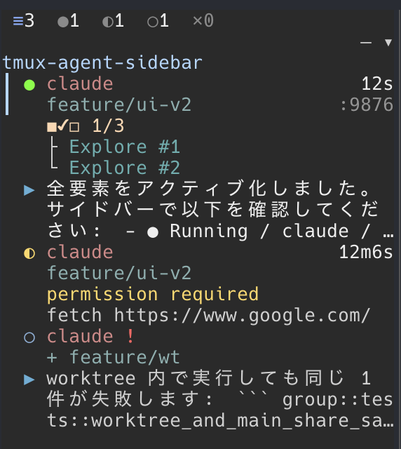

<h1 align="center">tmux-agent-sidebar</h1>

<p align="center">A tmux sidebar that monitors all AI coding agents (Claude Code, Codex) across every session and window — statuses, prompts, git info, activity logs, and more in one place.</p>

<p align="center"></p>

## Features

- **Cross-session monitoring** — Shows all agents across every tmux session and window in one sidebar
- **Activity log** — Streams each tool invocation (Read, Edit, Bash, etc.) per agent in real time
- **Task & subagent tracking** — Displays task progress (e.g. `3/7`) and spawned subagents as a parent-child tree
- **Git integration** — Shows branch name, ahead/behind counts, PR number (`gh`), and per-file diff stats
- **Worktree-aware grouping** — Groups agents by the same repo, including worktrees, so related panes stay together
- **Pane metadata** — Shows listening localhost ports and execution command info for each pane

## Agent Pane

<table>
  <tr>
    <td width="55%"></td>
    <td valign="top">
      <ul>
        <li><b>Status icon</b> — <code>●</code> running / <code>◐</code> waiting / <code>○</code> idle / <code>✕</code> error</li>
        <li><b>Agent color</b> — Claude (terracotta) / Codex (purple)</li>
        <li><b>Permission badge</b> — <code>plan</code> / <code>edit</code> / <code>auto</code> / <code>!</code></li>
        <li><b>Session name</b> — tmux session the pane belongs to</li>
        <li><b>+ marker</b> — indicates a git worktree</li>
        <li><b>Branch</b> — current git branch for the pane's cwd</li>
        <li><b>Elapsed time</b> — time since the last user prompt</li>
        <li><b>Task progress</b> — e.g. <code>3/7</code>, synced from the agent's task list</li>
        <li><b>Subagent tree</b> — parent-child branches for spawned subagents</li>
        <li><b>Listening ports</b> — localhost ports the pane's process is listening on</li>
        <li><b>Response arrow (▶)</b> — latest agent response preview</li>
        <li><b>Prompt text</b> — latest user prompt</li>
        <li><b>Wait reason</b> — why the agent is waiting (yellow, Claude only)</li>
      </ul>
    </td>
  </tr>
</table>

## Requirements

- tmux 3.0+
- [TPM](https://github.com/tmux-plugins/tpm) (recommended, for plugin installation)
- [Rust](https://rustup.rs/) (only if building from source)
- [GitHub CLI](https://cli.github.com/) (optional, for PR number display in Git tab)

## Setting Up

### 1. Installation

#### Installation with TPM

Add the plugin to your `tmux.conf`:

```tmux
set -g @plugin 'hiroppy/tmux-agent-sidebar'
run '~/.tmux/plugins/tpm/tpm'
```

Press `prefix + I` to install. On first run, an install wizard will prompt you to download a pre-built binary or build from source.

To update later, press `prefix + U` in TPM's plugin list and select `tmux-agent-sidebar`. The install wizard runs again if the bundled binary has changed.

#### Manual

1. Clone the repository:

```sh
git clone https://github.com/hiroppy/tmux-agent-sidebar.git ~/.tmux/plugins/tmux-agent-sidebar
```

2. Add the plugin to your `tmux.conf`:

```tmux
run-shell ~/.tmux/plugins/tmux-agent-sidebar/tmux-agent-sidebar.tmux
```

3. Install the binary using one of the following methods:

   <details>
   <summary>Download pre-built binary</summary>

   ```sh
   # macOS (Apple Silicon)
   curl -fSL https://github.com/hiroppy/tmux-agent-sidebar/releases/latest/download/tmux-agent-sidebar-darwin-aarch64 \
     -o ~/.tmux/plugins/tmux-agent-sidebar/bin/tmux-agent-sidebar
   chmod +x ~/.tmux/plugins/tmux-agent-sidebar/bin/tmux-agent-sidebar
   ```

   </details>

   <details>
   <summary>Build from source (requires Rust)</summary>

   ```sh
   cd ~/.tmux/plugins/tmux-agent-sidebar
   cargo build --release
   ```

   </details>

### 2. Reload tmux config

After updating `tmux.conf`, press `prefix + r` to reload.

### 3. Agent Hooks

The sidebar receives status updates through agent hooks. Add the following hook configurations to your agent settings.

#### 3.1 Claude Code

Add to your Claude Code hooks configuration (e.g. `~/.claude/settings.json`):

<details>
<summary>Claude Code hooks JSON</summary>

```json
{
  "hooks": {
    "SessionStart": [
      {
        "matcher": "",
        "hooks": [
          {
            "type": "command",
            "command": "bash ~/.tmux/plugins/tmux-agent-sidebar/hook.sh claude session-start"
          }
        ]
      }
    ],
    "SessionEnd": [
      {
        "matcher": "",
        "hooks": [
          {
            "type": "command",
            "command": "bash ~/.tmux/plugins/tmux-agent-sidebar/hook.sh claude session-end"
          }
        ]
      }
    ],
    "UserPromptSubmit": [
      {
        "matcher": "",
        "hooks": [
          {
            "type": "command",
            "command": "bash ~/.tmux/plugins/tmux-agent-sidebar/hook.sh claude user-prompt-submit"
          }
        ]
      }
    ],
    "Stop": [
      {
        "matcher": "",
        "hooks": [
          {
            "type": "command",
            "command": "bash ~/.tmux/plugins/tmux-agent-sidebar/hook.sh claude stop"
          }
        ]
      }
    ],
    "StopFailure": [
      {
        "matcher": "",
        "hooks": [
          {
            "type": "command",
            "command": "bash ~/.tmux/plugins/tmux-agent-sidebar/hook.sh claude stop-failure"
          }
        ]
      }
    ],
    "Notification": [
      {
        "matcher": "",
        "hooks": [
          {
            "type": "command",
            "command": "bash ~/.tmux/plugins/tmux-agent-sidebar/hook.sh claude notification"
          }
        ]
      }
    ],
    "PostToolUse": [
      {
        "matcher": "",
        "hooks": [
          {
            "type": "command",
            "command": "bash ~/.tmux/plugins/tmux-agent-sidebar/hook.sh claude activity-log"
          }
        ]
      }
    ],
    "PermissionDenied": [
      {
        "matcher": "",
        "hooks": [
          {
            "type": "command",
            "command": "bash ~/.tmux/plugins/tmux-agent-sidebar/hook.sh claude permission-denied"
          }
        ]
      }
    ],
    "CwdChanged": [
      {
        "matcher": "",
        "hooks": [
          {
            "type": "command",
            "command": "bash ~/.tmux/plugins/tmux-agent-sidebar/hook.sh claude cwd-changed"
          }
        ]
      }
    ],
    "SubagentStart": [
      {
        "matcher": "",
        "hooks": [
          {
            "type": "command",
            "command": "bash ~/.tmux/plugins/tmux-agent-sidebar/hook.sh claude subagent-start"
          }
        ]
      }
    ],
    "SubagentStop": [
      {
        "matcher": "",
        "hooks": [
          {
            "type": "command",
            "command": "bash ~/.tmux/plugins/tmux-agent-sidebar/hook.sh claude subagent-stop"
          }
        ]
      }
    ],
    "TaskCreated": [
      {
        "matcher": "",
        "hooks": [
          {
            "type": "command",
            "command": "bash ~/.tmux/plugins/tmux-agent-sidebar/hook.sh claude task-created"
          }
        ]
      }
    ],
    "TaskCompleted": [
      {
        "matcher": "",
        "hooks": [
          {
            "type": "command",
            "command": "bash ~/.tmux/plugins/tmux-agent-sidebar/hook.sh claude task-completed"
          }
        ]
      }
    ],
    "TeammateIdle": [
      {
        "matcher": "",
        "hooks": [
          {
            "type": "command",
            "command": "bash ~/.tmux/plugins/tmux-agent-sidebar/hook.sh claude teammate-idle"
          }
        ]
      }
    ],
    "WorktreeCreate": [
      {
        "matcher": "",
        "hooks": [
          {
            "type": "command",
            "command": "bash ~/.tmux/plugins/tmux-agent-sidebar/hook.sh claude worktree-create"
          }
        ]
      }
    ],
    "WorktreeRemove": [
      {
        "matcher": "",
        "hooks": [
          {
            "type": "command",
            "command": "bash ~/.tmux/plugins/tmux-agent-sidebar/hook.sh claude worktree-remove"
          }
        ]
      }
    ]
  }
}
```

</details>

#### 3.2 Codex

Create or edit `~/.codex/hooks.json`:

<details>
<summary>Codex hooks JSON</summary>

```json
{
  "hooks": {
    "SessionStart": [
      {
        "matcher": "startup|resume",
        "hooks": [
          {
            "type": "command",
            "command": "bash ~/.tmux/plugins/tmux-agent-sidebar/hook.sh codex session-start"
          }
        ]
      }
    ],
    "UserPromptSubmit": [
      {
        "hooks": [
          {
            "type": "command",
            "command": "bash ~/.tmux/plugins/tmux-agent-sidebar/hook.sh codex user-prompt-submit"
          }
        ]
      }
    ],
    "Stop": [
      {
        "hooks": [
          {
            "type": "command",
            "command": "bash ~/.tmux/plugins/tmux-agent-sidebar/hook.sh codex stop"
          }
        ]
      }
    ],
    "SessionEnd": [
      {
        "hooks": [
          {
            "type": "command",
            "command": "bash ~/.tmux/plugins/tmux-agent-sidebar/hook.sh codex session-end"
          }
        ]
      }
    ]
  }
}
```

</details>

## Keybindings

| Key | Action |
|---|---|
| `prefix + e` | Toggle sidebar (default, customizable) |
| `prefix + E` | Toggle sidebar in all windows (default, customizable) |
| `j` / `Down` | Move selection down (filter → agents → bottom panel) |
| `k` / `Up` | Move selection up |
| `h` / `Left` | Previous status filter (filter bar only) |
| `l` / `Right` | Next status filter (filter bar only) |
| `r` | Open repo filter popup (filter bar only) |
| `Enter` | Jump to selected agent's pane / confirm repo popup |
| `Tab` | Cycle status filter (All → Running → Waiting → Idle → Error) |
| `Shift+Tab` | Switch bottom panel tab (Activity / Git) |
| `Esc` | Return focus to agents panel / close repo popup |
| Mouse click | Click agent to jump to its pane, click status tabs to filter, click the repo area to open the repo popup |


## Feature Support by Agent

| Feature | Claude Code | Codex | Notes |
|---|---|---|---|
| Status tracking (running / idle / error) | :white_check_mark: | :white_check_mark: | Driven by `SessionStart` / `UserPromptSubmit` / `Stop` |
| Prompt text display | :white_check_mark: | :white_check_mark: | Saved from `UserPromptSubmit` |
| Response text display (`▶ ...`) | :white_check_mark: | :white_check_mark: | Populated from `Stop` payload |
| Waiting status + wait reason | :white_check_mark: | :x: | Populated from `Notification`, `PermissionDenied`, and `TeammateIdle` (all Claude-only) |
| API failure reason display | :white_check_mark: | :x: | `StopFailure` is wired only for Claude |
| Permission badge | :white_check_mark: (`plan` / `edit` / `auto` / `!`) | :white_check_mark: (`auto` / `!` only) | Codex badges are inferred from process args |
| Git branch display | :white_check_mark: | :white_check_mark: | Uses the pane `cwd`; Claude updates dynamically via `CwdChanged` |
| Elapsed time | :white_check_mark: | :white_check_mark: | Since the last prompt |
| Task progress | :white_check_mark: | :x: | Requires `PostToolUse` |
| Task lifecycle notifications | :white_check_mark: | :x: | Requires `TaskCreated` / `TaskCompleted` |
| Subagent display | :white_check_mark: | :x: | Requires `SubagentStart` / `SubagentStop` |
| Activity log | :white_check_mark: | :x: | Requires `PostToolUse` |
| Worktree lifecycle tracking | :white_check_mark: | :x: | Requires `WorktreeCreate` / `WorktreeRemove` |

### Known Limitations

- **Waiting status (Claude Code)** — After approving a permission prompt, the status stays `waiting` until the next hook event fires. This is a limitation of the Claude Code hook system.
- **Codex hook coverage** — Codex only emits `SessionStart`, `UserPromptSubmit`, `Stop`, and `SessionEnd`, so waiting status, activity log, task progress, subagent display, and worktree tracking are unavailable.

## Customization

Most options can be set **before** loading the plugin in your `tmux.conf`:

```tmux
# Sidebar
set -g @sidebar_key T                    # keybinding (default: e)
set -g @sidebar_key_all Y                # keybinding for all windows (default: E)
set -g @sidebar_width 32                 # width in columns or % (default: 15%)
set -g @sidebar_bottom_height 20         # bottom panel height in lines (default: 20, 0 to hide)
set -g @sidebar_auto_create off          # disable auto-create on new windows (default: on)

# Colors (256-color palette numbers) — all defaults live in src/ui/colors.rs
set -g @sidebar_color_all 111            # selected "all" filter icon (default: 111 sky blue)
set -g @sidebar_color_running 114        # selected running filter icon and running pane status (default: 114 green)
set -g @sidebar_color_waiting 221        # selected waiting filter icon, waiting pane status, version banner (default: 221 yellow)
set -g @sidebar_color_idle 110           # selected idle filter icon and idle pane status (default: 110 soft blue)
set -g @sidebar_color_error 203          # selected error filter icon and error pane status (default: 203 red)
set -g @sidebar_color_filter_inactive 245 # unselected status filter icons and zero counts (default: 245 mid gray)
set -g @sidebar_color_border 240         # unfocused panel borders and tab separators (default: 240 dark gray)
set -g @sidebar_color_accent 153         # active pane marker, focused repo header, focused bottom panel border, repo popup border (default: 153 pale sky blue)
set -g @sidebar_color_session 39         # session name (default: 39 blue)
set -g @sidebar_color_agent_claude 174   # Claude brand color (default: 174 terracotta)
set -g @sidebar_color_agent_codex 141    # Codex brand color (default: 141 purple)
set -g @sidebar_color_text_active 255    # primary text (active rows, counts, filtered repo label) (default: 255 white)
set -g @sidebar_color_text_muted 252     # secondary text (idle rows, tree branches, empty-state messages, inactive bottom tabs) (default: 252 light gray)
set -g @sidebar_color_port 246           # port numbers (default: 246 light gray)
set -g @sidebar_color_wait_reason 221    # wait reason text (default: 221 yellow)
set -g @sidebar_color_selection 237      # selected row background (default: 237 dark gray)
set -g @sidebar_color_branch 109         # git branch name (default: 109 teal)
set -g @sidebar_color_task_progress 223   # task progress summary (default: 223 pale yellow)
set -g @sidebar_color_subagent 73         # subagent tree (default: 73 green)
set -g @sidebar_color_commit_hash 221     # commit hash (default: 221 yellow)
set -g @sidebar_color_diff_added 114      # added diff lines (default: 114 green)
set -g @sidebar_color_diff_deleted 174    # deleted diff lines (default: 174 terracotta)
set -g @sidebar_color_file_change 221     # file change stats (default: 221 yellow)
set -g @sidebar_color_pr_link 117         # PR link / number (default: 117 blue)
set -g @sidebar_color_section_title 109   # section titles (default: 109 teal)
set -g @sidebar_color_activity_timestamp 109 # activity timestamps (default: 109 teal)
set -g @sidebar_color_response_arrow 74   # response arrow (default: 74 cyan)

# Icons (Unicode glyphs; defaults keep the current look)
set -g @sidebar_icon_all ≡               # status filter bar "all" icon
set -g @sidebar_icon_running ●           # running status icon
set -g @sidebar_icon_waiting ◐           # waiting status icon
set -g @sidebar_icon_idle ○              # idle status icon
set -g @sidebar_icon_error ✕             # error status icon
set -g @sidebar_icon_unknown ·           # unknown status icon

run-shell ~/.tmux/plugins/tmux-agent-sidebar/tmux-agent-sidebar.tmux
```

## Accessing Agent Status from Scripts

The sidebar stores agent status in tmux pane options, which you can read from your own scripts or status bar:

```sh
# Get a specific pane's agent status
tmux show -t "$pane_id" -pv @pane_status
# Returns: running / waiting / idle / error / (empty)

# Get agent type
tmux show -t "$pane_id" -pv @pane_agent
# Returns: claude / codex / (empty)
```

This is useful for integrating agent status into your tmux status bar, custom scripts, or notifications.

## Uninstalling

1. Remove the `set -g @plugin` (or `run-shell`) line from your `tmux.conf`
2. Remove hook entries from your Claude Code / Codex settings
3. Remove the plugin directory: `rm -rf ~/.tmux/plugins/tmux-agent-sidebar`
